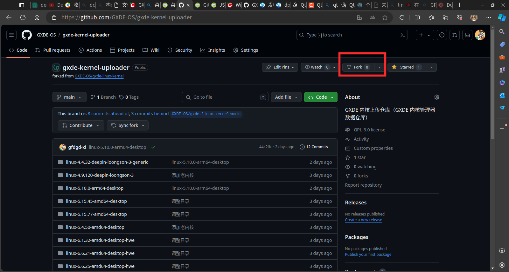
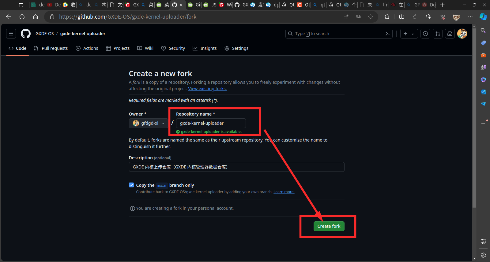
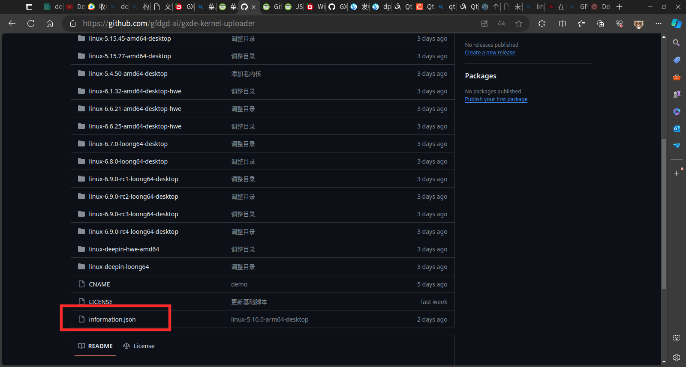
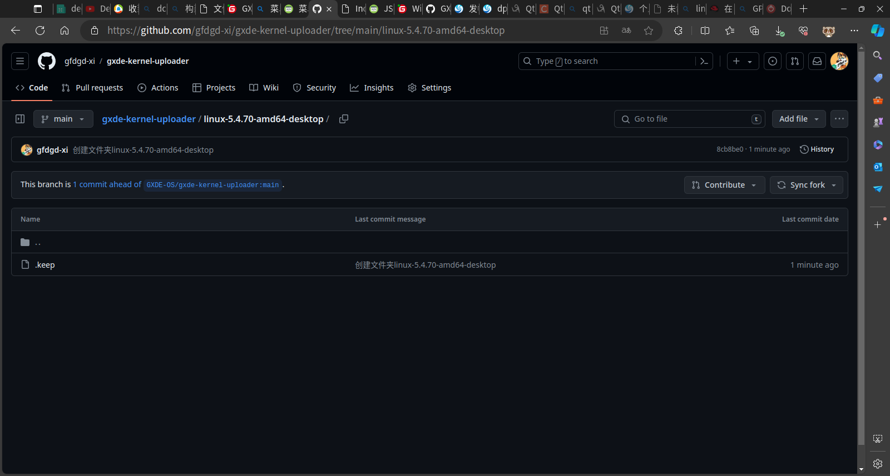
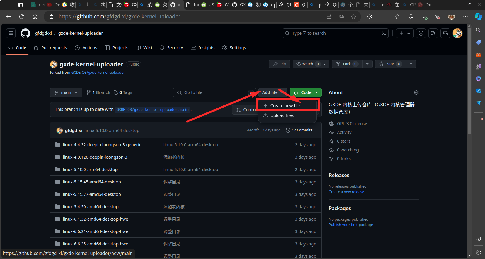
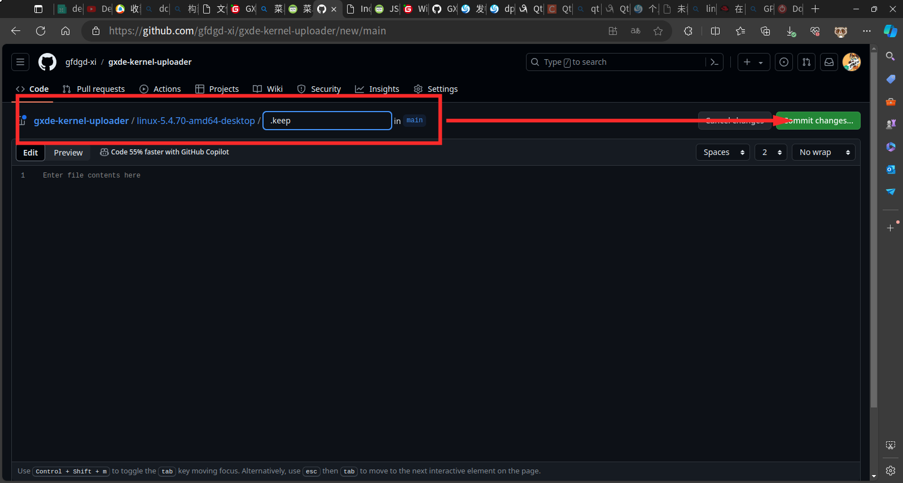
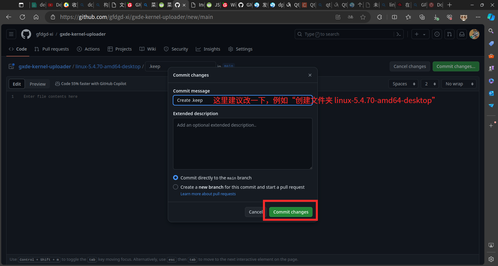

## 如何投稿内核
> 所需知识：git 的基础操作、json 语法  
> 所需条件：Github 账户一个  
> json 语法可见：https://www.runoob.com/json/json-syntax.html  
> git 操作教程可见：https://www.runoob.com/git/git-tutorial.html    
> ***注：目前只支持投稿 deb 格式的内核包，暂不支持其它格式***

1. fork 该仓库到自己账户下

  
  

2. 然后修改代码仓库下的 information.json 文件，修改规范看下面“json 格式”  

  

3. 修改完成后在代码仓库根目录创建和 json 名称一样/有关联的文件夹，不允许出现中文和空格，例如`内核 6.6.6`就不行，可以是类似`linux-6.6.25-amd64-desktop-hwe`这种  
  Github 在线编辑器不支持创建文件夹，但可以通过创建文件的方法来变相创建文件夹，可以见“Github 在线管理器如何创建文件夹”

  

4. 上传内核 deb 文件  
  因为 github 在线上传文件大小有限制，所以需要 git clone 到本地进行处理，以下操作均需要在终端进行  
  a. 拉取仓库：  
    ```bash
    sudo apt update
    sudo apt install git
    git clone https://github.com/GXDE-OS/gxde-kernel-uploader --depth=1
    ```
    然后找到 gxde-kernel-uploader 文件夹，然后打开自己创建的目录

## Github 在线管理器如何创建文件夹
***Git 是不支持空文件夹的，所以需要使用创建文件的方法来创建非空文件夹***

1. 首先需要创建一个文件  
  

2. 然后上面的路径框可以填需要创建文件夹的具体路径，然后在后面接上`/.keep`，如我想在代码仓库根目录创建 `linux-5.4.70-amd64-desktop` 文件夹，则需要填写 `linux-5.4.70-amd64-desktop/.keep`，然后文件内容为空即可，然后点击 commit 即可创建  
  
  

3. 然后上传完其它代码/文件时将该目录下的 .keep 文件删除即可